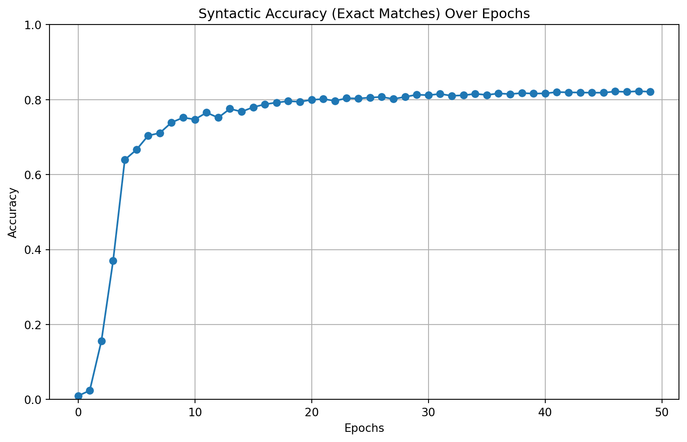
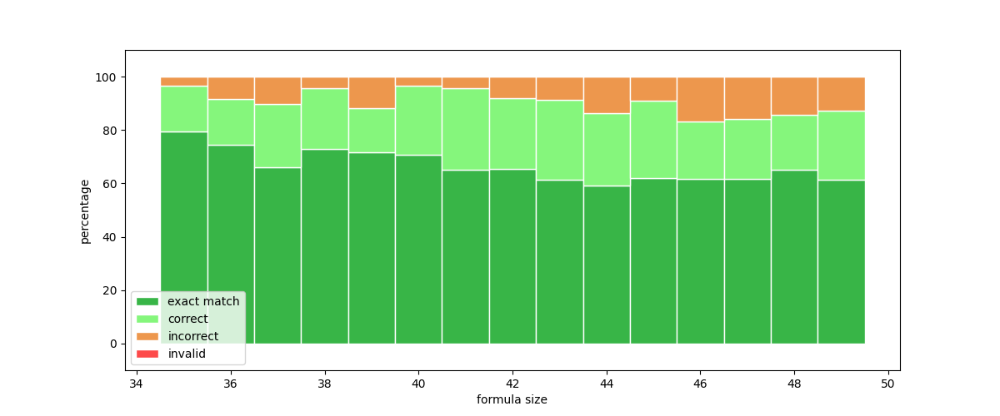
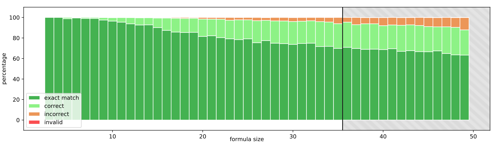

# DeepLTL PyTorch

This project trains a Transformer model to generate traces for linear-time temporal logical (LTL) formulas.

This repository is the unofficial PyTorch implementation of the ICLR'21 paper [Teaching Temporal Logics to Neural Networks](https://arxiv.org/abs/2003.04218).
Read the paper or see the README file [in the official repository](https://github.com/reactive-systems/deepltl) for more information about the project.

    
## Requirements

Ensure that you have a working PyTorch installation.
Then, install the required pip packages as follows:
```sh
pip install tqdm numpy matplotlib
pip install python-sat[aiger,approxmc,cryptosat,pblib]
pip install py-aiger-sat
```

In addition, the LTL, automata manipulation and model checking library [Spot](https://spot.lrde.epita.fr) is required. Please follow the [download and installation instructions](https://spot.lrde.epita.fr/install.html) on their website.


## Training

To train a model on the `ltl-35` dataset with the best parameters given by the authors, run:
```sh
python -m deepltl.train.train_transformer --problem='ltl' --ds-name='ltl-35' --num-layers=8 --num-heads=8 --d-ff=1024 --batch-size=768 --run-name=ltl-best --epochs=50
# Optionally, you can enable tree-based positional encoding using --tree-pos-enc
```

You can start Tensorboard to visualize training metrics by running:
```sh
tensorboard --logdir ./runs/ltl-best/tensorboard/
```

The figure below plots the syntactic accuracy (the ratio of exact formula matches, called `accuracy_per_sequence` in Tensorboard) of this model without tree-based positional encoding.
This result is quite close to the result from the paper given in Figure 8.


I didn't test training with the `prop-35` dataset.
For a list of available datasets, see the README file [in the official repository](https://github.com/reactive-systems/deepltl).

## Evaluation

Simply add `--test` argument to the command for evalution.  Some datasets such as `ltl-50-test` can only be used for testing.

Assuming that you've trained a model named `ltl-tree` with tree-based positional encoding and the parameters given in the previous section, you can test this model on the first 1000 samples of `ltl-50-test` as follows:
```sh
python -m deepltl.train.train_transformer --problem='ltl' --ds-name='ltl-50-test' --num-layers=8 --num-heads=8 --d-ff=1024 --batch-size=768 --tree-pos-enc --run-name=ltl-tree --test --test-limit=1000
```
This command will create `test.log` and `test_results.png` files in `runs/ltl-tree/`.
Note that this command may take a lot of time due to trace checking.

Now, we had a model that was only trained on LTL formulas up to length 35 (`ltl-35` dataset), and using the previous command, we have evaluated it on LTL formulas up to length 50 (`ltl-50-test` dataset).
The results are as follows:


This shows that the model can generalize to the formulas of a size it has never been trained on.
The figure below shows the corresponding results from the paper for comparison (see the shaded area):



## Command Line Arguments

### Model Settings

| command line argument | default   | parameter                                                    |
| --------------------- | --------- | ------------------------------------------------------------ |
| problem               | ltl       | problem (either ltl or prop)                                 |
| ds-name               | ltl-35    | dataset name                                                 |
| run-name              | default   | name of the training / testing run                           | 
| d-embed-enc           | 128       | embedding dimension encoder                                  |
| d-embed-dec           | 128       | embedding dimension decoder                                  |
| num-layers            | 4         | number of encoder/decoder layers                             |
| num-heads             | 4         | number of attention heads                                    |
| d-ff                  | 512       | dimension of fully-connected feed-forward networks           |
| ff-activation         | relu      | activation function of fully-connected feed-forward networks |
| dropout               | 0.1       | amount of dropped out units                                  |
| tree-pos-enc          | False     | whether to use the tree positional encoding                  |
| layer-norm-eps        | 1e-6      | epsilon value used in layer normalization                    |

### Training

| command line argument | default   | parameter                                                    |
| --------------------- | --------- | ------------------------------------------------------------ |
| warmup-steps          | 4000      | number of warmup steps                                       |
| batch-size            | 100       | batch size                                                   |
| epochs                | 3         | number of epochs                                             |
| seed                  | None      | seed for the random number generator for reproducibility     |

### Testing

| command line argument | default   | parameter                                                    |
| --------------------- | --------- | ------------------------------------------------------------ |
| batch-size            | 100       | batch size                                                   |
| alpha                 | 1.0       | beam search parameter for length normalization               |
| beam-size             | 2         | beam size                                                    |
| test-limit            | None      | limit the number of samples while testing                    |